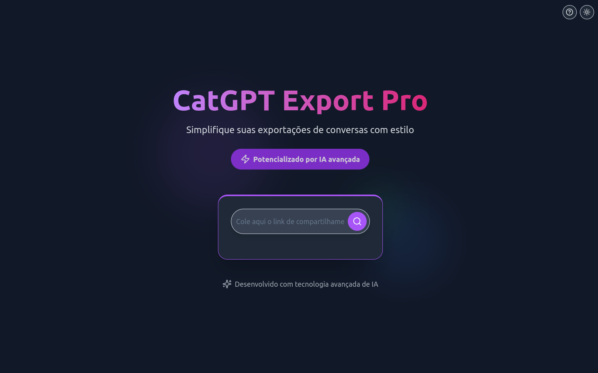
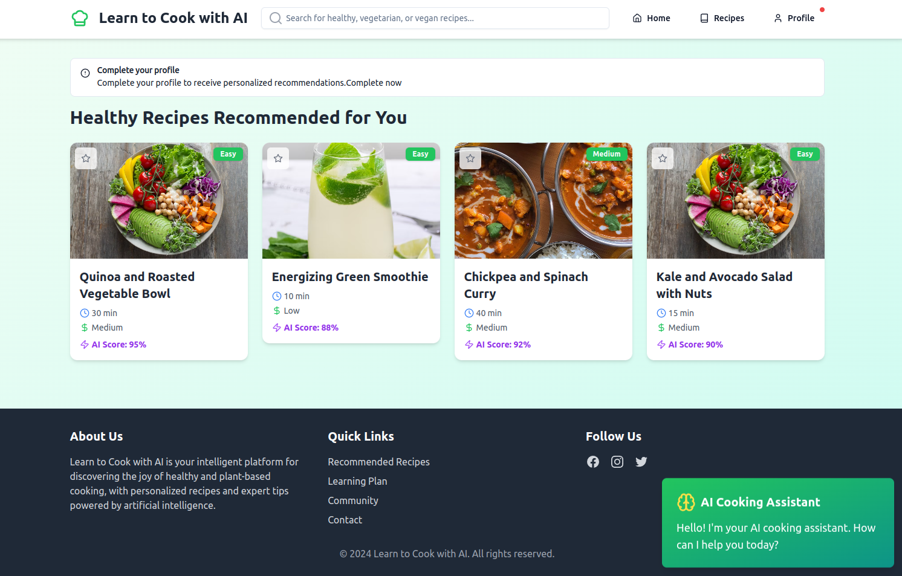
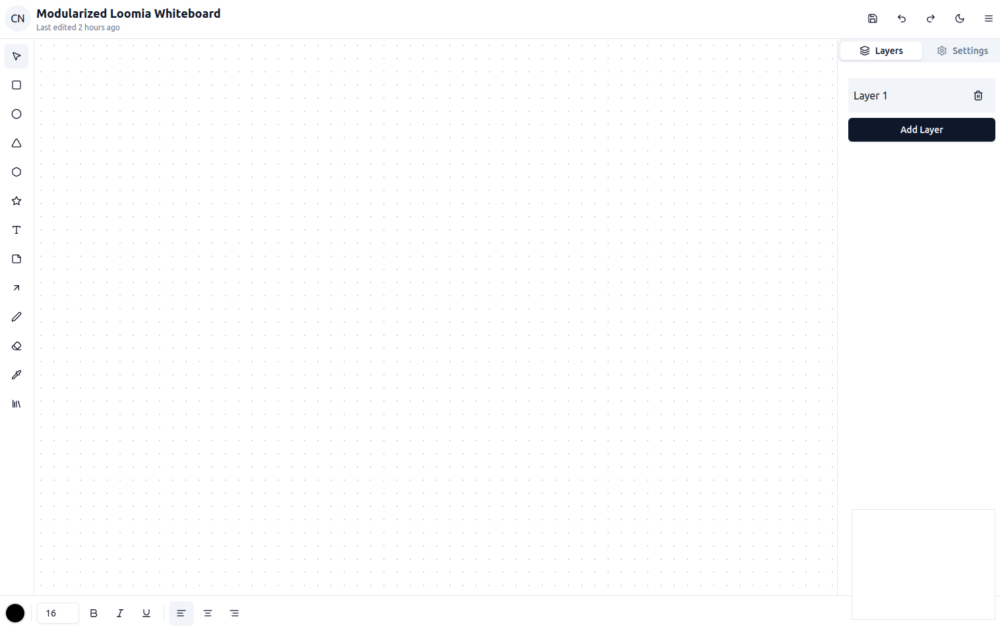
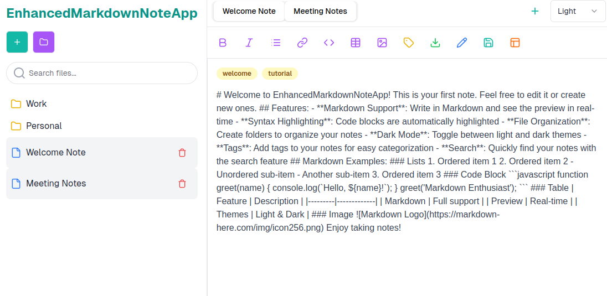
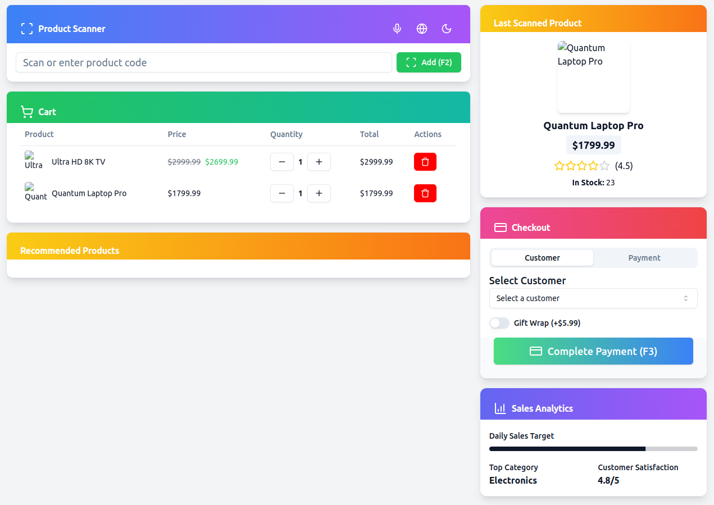
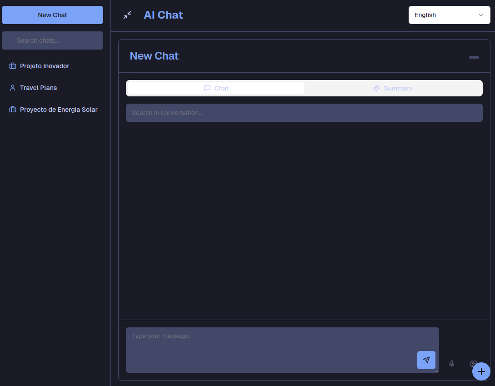

# 🛠️✨ **AI Design Catalog** ✨🛠️

**Welcome to the AI Design Catalog!** 🎨🚀  
This repository showcases a diverse collection of AI-generated design projects, presented in a visually appealing and user-friendly interface. Each project is dynamically loaded, offering an interactive and seamless experience to explore unique design ideas and implementations.

---

## 🌟 **Features** 🌟

- 🔄 **Dynamic Loading**: Effortlessly browse through dynamically loaded projects without the need for manual configuration.
- 🖥️ **Intuitive Interface**: Navigate a sleek, well-organized catalog interface for a better user experience.
- 💡 **Advanced UI Components**: Built with modern, interactive components styled using Tailwind CSS and ShadCN UI.
- ⚙️ **Easy Customization**: Easily modify each project to suit your needs.

---

## 🖼️ **Screenshots** 🖼️

### 🗂️ **Main Catalog Page**

Get a bird's-eye view of all the AI-generated design projects in the catalog.

### 🔍 **Dynamic Project View**

Explore individual projects with rich, interactive content dynamically rendered for a seamless experience.








---

## 🚀 **Getting Started** 🚀

Follow these steps to set up the project locally and explore the catalog:

### 1. **Clone the Repository**

Clone the repository to your local machine using the command:

```bash
git clone https://github.com/felipepimentel/ai-design-catalog.git
```

### 2. **Navigate to the Project Directory**

```bash
cd ai-design-catalog
```

### 3. **Install Dependencies**

Install all necessary dependencies for the project, including React, Vite, Tailwind CSS, ShadCN UI, and others:

```bash
npm install
```

### 4. **Run the Project**

Start the development server with Vite:

```bash
npm run dev
```

Open your browser and go to [http://localhost:3000](http://localhost:3000) to view the project.

### 5. **Explore the Catalog**

- Browse the list of projects on the main page.
- Click on any project to dynamically view its content.

---

## 🧩 **Project Structure** 🧩

The project is organized as follows to ensure easy navigation and maintenance:

```bash
ai-design-catalog/
│
├── assets/                       # Directory for storing project assets, including images
│   ├── images/                   # Images for the README and documentation
│   │   ├── banner.png            # Banner image for the project
│   │   ├── main-page.png         # Screenshot of the main catalog page
│   │   └── project-view.png      # Screenshot of a dynamic project view
│   └── ...
├── public/                       # Static files served by Vite
├── src/
│   ├── components/               # Shared components
│   ├── catalog/                  # Catalog page and components
│   ├── projects/                 # Individual projects
│   │   ├── project-001/          # Project 001
│   │   │   ├── App.tsx           # Main component of the project
│   │   │   └── index.tsx         # Entry point for the project
│   │   ├── project-002/          # Project 002
│   │   └── ...                   # Other projects
│   ├── App.tsx                   # Main application component
│   ├── index.tsx                 # Entry point of the application
│   └── styles.css                # Global styles
│
├── .gitignore                    # Git ignore file
├── tsconfig.json                 # TypeScript configuration
├── vite.config.ts                # Vite configuration
├── package.json                  # Project dependencies and scripts
└── README.md                     # Project documentation
```

---

## 🛠️ **Adding New Projects to the Catalog** 🛠️

Follow these simple steps to add new AI-generated design projects to the catalog:

1. **Create a New Folder** inside the `src/projects/` directory with a unique name, for example, `project-003`.
2. **Add the `App.tsx` File**:
    ```tsx
    import React from 'react';

    const App: React.FC = () => {
      return (
        <div className="p-4">
          <h1 className="text-2xl font-bold">Project 003</h1>
          <p>This is a dynamically loaded project example.</p>
        </div>
      );
    };

    export default App;
    ```
3. **Run the Project**: The new project will be automatically detected and listed in the catalog. No additional configuration is required!

---

## 🎨 **Contributing** 🎨

We welcome contributions! If you have ideas for new projects, improvements, or bug fixes, feel free to open an issue or submit a pull request. Let's build an amazing AI design catalog together!

---

## 📄 **License** 📄

This project is licensed under the [MIT License](LICENSE). Feel free to use, modify, and distribute it as you wish.

---

## 📞 **Contact** 📞

If you have any questions or suggestions, feel free to reach out through [my GitHub profile](https://github.com/felipepimentel).

---

**Thank you for checking out the AI Design Catalog! Let your creativity flow and have fun exploring!** ✨
